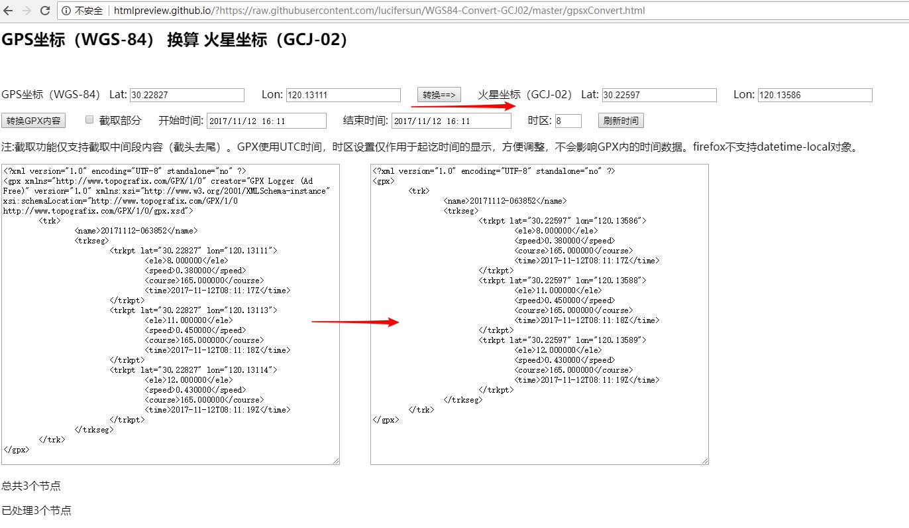

# WGS84-Convert-GCJ02
将WGS84坐标的GPX文件转换成GCJ02,也可以单独转换坐标。 
GPX文件可以按起讫时间截取部分，但仅支持掐头去尾。 
所有计算都在本地完成，不会上传数据，保证隐私。 
如果GPX数据量较大，贴入文本区时会需要较长时间，请耐心等待。 

http://htmlpreview.github.com/?https://raw.githubusercontent.com/lucifersun/WGS84-Convert-GCJ02/master/gpsxConvert.html

